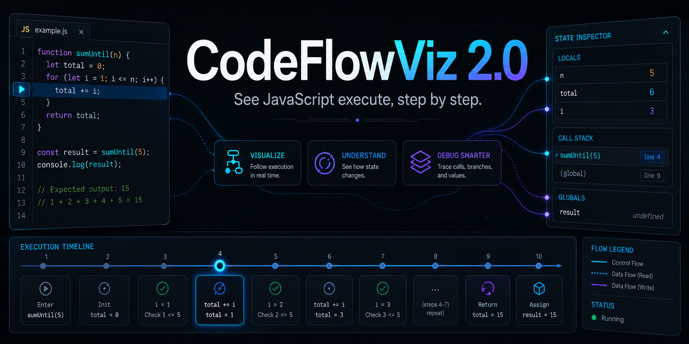
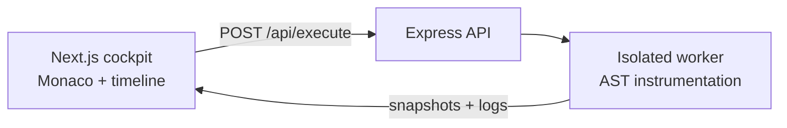

# CodeFlowViz 2.0

<p align="center">
  <strong>See JavaScript execute, step by step.</strong><br />
  Turn source code into a replayable timeline of control flow, logs, and variable state.
</p>

<p align="center">
  <a href="https://code-flow-viz-2-0.vercel.app"><strong>Try the live demo</strong></a>
  ·
  <a href="#quick-start">Run locally</a>
  ·
  <a href="CONTRIBUTIONS.md">Contribute</a>
</p>

<p align="center">
  
  
  
  
</p>



## What it does

Paste a JavaScript snippet, run it in an isolated worker, and inspect how execution unfolds. CodeFlowViz combines a Monaco editor with a timeline and state inspector so that control flow is easier to understand than a stream of console output.

- Follow line-level execution snapshots.
- Scrub backward and forward through a completed run.
- Inspect variables and captured logs at each step.
- See the active source line alongside runtime state.
- Estimate algorithmic complexity from loop nesting.
- Switch themes and dock the execution panel at the bottom or right.

## Where it helps

- **Learning algorithms:** see loops, branches, and state changes instead of tracing them on paper.
- **Teaching:** walk through a snippet one execution step at a time.
- **Code review:** explain small control-flow examples with a shared visual model.
- **Debugging snippets:** find the step where a value first becomes unexpected.

## CodeFlowViz vs. a traditional debugger

| | CodeFlowViz | Traditional debugger |
| --- | --- | --- |
| Primary goal | Visual explanation and replay | Full application debugging |
| Setup | Paste a small snippet and run | Attach to a local or remote process |
| Execution history | Timeline stays available after the run | Usually inspected at live breakpoints |
| Best for | Learning, teaching, and reasoning about small examples | Production applications and deep runtime inspection |

CodeFlowViz complements browser and IDE debuggers; it is not intended to replace them.

## Architecture



| Layer | Technology |
| --- | --- |
| Frontend | Next.js 14, React, Framer Motion, Monaco Editor |
| Backend | Node.js, Express, worker threads |
| Tracing | Acorn-based JavaScript instrumentation |
| Deployment | Vercel frontend, long-running Node.js backend |

The frontend and execution service are separate workspaces. This keeps the UI easy to deploy while allowing traced code to run in a resource-limited worker instead of a short-lived frontend function.

## Quick start

### Requirements

- Node.js 20+
- npm 10+

### Install and run

```bash
git clone https://github.com/kauntiaakash2/CodeFlowViz-2.0.git
cd CodeFlowViz-2.0
npm install
```

The frontend calls its same-origin `/api/execute` proxy. To override the local
backend URL, create `frontend/.env.local`:

```bash
EXECUTE_API_URL=http://localhost:4000/api/execute
```

Optionally create `backend/.env`:

```bash
PORT=4000
CORS_ORIGIN=http://localhost:3000
```

Start both workspaces:

```bash
npm run dev
```

Open [http://localhost:3000](http://localhost:3000). The backend runs at `http://localhost:4000`.

### Useful commands

| Command | Purpose |
| --- | --- |
| `npm run dev` | Start frontend and backend development servers |
| `npm run dev:frontend` | Start only the Next.js app |
| `npm run dev:backend` | Start only the execution service |
| `npm run build` | Create the frontend production build |
| `npm run start:frontend` | Start the built frontend |
| `npm run start:backend` | Start the backend |
| `npm run lint` | Lint the frontend |

Verify the backend:

```bash
curl http://localhost:4000/api/health
```

```json
{
  "status": "ok",
  "service": "codeflowviz-backend",
  "timestamp": "..."
}
```

## API

Send code to `POST /api/execute`:

```bash
curl --request POST http://localhost:4000/api/execute \
  --header "Content-Type: application/json" \
  --data '{"code":"let total = 0; for (let i = 1; i <= 3; i++) total += i; console.log(total);","language":"javascript"}'
```

The response includes the execution result, logs, timeline snapshots, duration, timeout state, and a successful run's complexity estimate.

## Current scope and limitations

- The end-to-end editor experience currently targets JavaScript.
- The backend accepts Java through an early execution path, but Java is not yet fully exposed in the UI.
- Python, C, and C++ tracing are not supported yet.
- The complexity value is a heuristic based on detected loop nesting, not a formal Big-O proof.
- Runs accept at most 20,000 characters and are time- and memory-limited.
- Trace sessions are not yet persisted or shareable.
- Only run code you understand; worker isolation reduces risk but is not a guarantee for hostile code.

## Roadmap

- Expand language support after the JavaScript path is hardened.
- Add higher-level control-flow overlays.
- Make trace sessions exportable and shareable.
- Persist custom cockpit layouts.
- Strengthen sandbox policies and test coverage.

## Contributing

Contributions are welcome through GirlScript Summer of Code (GSSoC) and outside it. Start with an open issue, keep the pull request focused, and include screenshots or trace examples for behavior changes.

Read the [contribution guide](CONTRIBUTIONS.md) and [code of conduct](CODE_OF_CONDUCT.md) before opening a pull request.

If CodeFlowViz helps you learn or explain code, a star helps other developers discover it.

## License

Released under the [MIT License](LICENSE).
