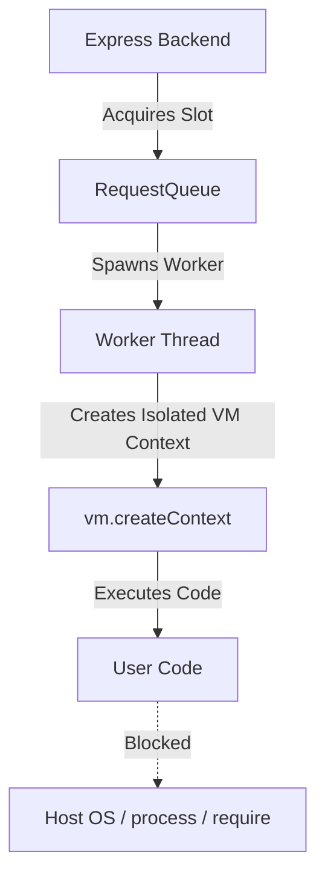

# Execution Sandbox Security & Threat Model

This document outlines the architecture, threat model, security boundaries, and mitigation mechanisms used to safely execute untrusted user code in the CodeFlowViz execution engine.

---

## 1. Sandbox Architecture

The execution engine uses a two-tier containment strategy to isolate untrusted code:

1. **Worker Threads (`node:worker_threads`)**:
   - The execution runs inside a separate OS-level thread using `executeWorker.mjs`.
   - Spawning workers isolated from the main event loop prevents blocking the backend's server execution and allows setting rigid thread-level resource caps.
2. **Virtual Machine Contexts (`node:vm`)**:
   - Inside the worker, a new V8 execution context is initialized using `vm.createContext()`.
   - The user script compiles and executes solely within this virtual machine context.

---

## 2. Threat Model & Mitigations

### Threat A: Sandbox Escape (Subversion of Isolation)
* **Description**: User code attempts to traverse prototype chains, leverage host function constructors, or use module resolution to obtain reference to host objects (e.g. `process`, `require`) or file system.
* **Mitigation**:
  - **Null-Prototype Context**: The global sandbox environment is constructed using `Object.create(null)` to eliminate default prototype properties (e.g. `.constructor` or `.toString()`).
  - **Sandbox-Native Function Wrappers**: Any host functions exposed to the sandbox (like `console.log` or `__trace.capture`) are wrapped in sandbox-native closures inside the VM context using `vm.runInContext`. This prevents bypasses that attempt to call `.constructor` on exposed host functions to acquire the host's `Function` compiler and `process` global.
  - **Disabled Dynamic Module Imports**: Dynamic imports (`import(...)`) are not enabled on the VM instance and will fail parsing/execution.

### Threat B: Denial of Service via Infinite Loops (CPU Exhaustion)
* **Description**: User code runs an infinite synchronous loop (e.g. `while(true) {}`) or recursive call stack to lock up CPU execution.
* **Mitigation**:
  - **VM Timeout Capping**: The `vm.Script.runInContext` command specifies a strict timeout. If execution takes longer than the allotted time, it is terminated synchronously.
  - **Grace Timer Safeguards**: A backup host-level timer terminates the worker thread if the thread becomes unresponsive or locks up beyond the expected execution window.

### Threat C: Resource Exhaustion (Memory Capping)
* **Description**: User code attempts to allocate massive arrays or objects to run the server out of memory.
* **Mitigation**:
  - **Thread-Level Resource Capping**: Worker threads are initialized with strict `resourceLimits`:
    - `maxOldGenerationSizeMb`: 32 MB
    - `maxYoungGenerationSizeMb`: 8 MB
    - `stackSizeMb`: 1 MB
  - If these limits are breached, the V8 engine automatically terminates the worker thread, triggering an exit code.

### Threat D: Process Instability (Unhandled Crashes)
* **Description**: Worker crashes or unhandled promise rejections propagate to the parent Express app and crash the entire web service.
* **Mitigation**:
  - **Isolation of Unhandled Rejections**: The worker thread listens for `unhandledRejection` and `uncaughtException` events. It serializes and reports these errors cleanly without letting them bubble up to the host process.
  - **Worker Event Binding**: The runner handles worker `error` and `exit` events gracefully, releasing queued slots and returning structured error payloads to the client.

---

## 3. Testing Methodology

The sandbox is guarded by a comprehensive security and execution test suite (`backend/src/sandbox/runner.test.mjs`) verifying:
1. **Functional Correctness**: Validates that valid, safe code executes and serializes outputs.
2. **Infinite Synchronous Loops**: Confirms that `while(true)` loops trigger a timeout and terminate cleanly.
3. **Async Hanging Loops**: Verifies that recursive promises or unresolved promises do not hang the backend.
4. **Subversion & Escape Bypasses**:
   - Asserts that `require` and Node.js core modules (like `fs`, `child_process`) are not accessible.
   - Asserts that `process` and process utilities are not defined.
   - Asserts that host constructor escapes (e.g. `console.log.constructor('return process')()`) are blocked.
   - Asserts that dynamic imports are disallowed.
5. **Memory Exhaustion**: Simulates heavy memory loading to trigger worker termination and ensure the system recovers gracefully.
